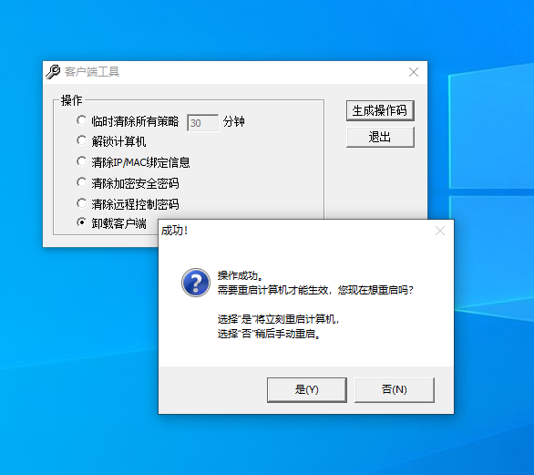

# FXXK IP-Guard
IP-Guard 客户端卸载工具。

> IP-guard是一款通用的内网安全软件。它运用系统管理思想，充分利用操作审计，权限管控，文档加密等技术手段，全面解决信息安全、应用效率、系统管理三项内网安全难题。借助IP-guard，企业能够有效地防范信息外泄，保护信息资产安全；营造健康安全的网络环境，提升工作效率的，合理分配网络资源；IT人员还能够轻松进行系统维护，保证系统运行时刻处于巅峰状态，促进业务快速发展。

IP-guard官网: http://www.ip-guard.net

## 免责声明

此git仓库内所有内容仅供学习交流，任何人不得将其用于非法用途，否则后果自行承担！

## 文件信息

同时放上原始文件与PATCH后的文件，不放心的可以进行对比。

```plain
# find .  -name "*.exe"|xargs sha256sum
21c3315f8ad8392ecc14457e1ed41edd13e29fd8d9405e33e7781876ba4c54f4 *./original/Agt3Tool.exe
a549765e1139e01c0f43ebc08f00dbe56a76a15ace5fe89a24c32774c73ea50d *./original/agttool.exe
879dcd57402bc1575f65361b361894ec9000a807f61214127451830c7524736b *./patched/Agt3Tool.exe
919cbf74e2a6f0b7863c92ff3000fe37828037ef8aa62129aba50e2cfe7cc62d *./patched/agttool.exe
```

## 使用方法

两个版本的卸载工具，任选一个即可。（运行时无需管理员权限）

* 运行`patched/Agt3Tool.exe`,选择卸载客户端->生成操作码->输入任意确认码->确定
* 运行`patched/agttool2.exe`,输入密码`123456`->确认



